# Tick & Taka

**Your days and your money, on one screen.** An Android app for people juggling work,
study and home: open it and see what to do next and how much is safe to spend today, then
log a task, an expense or an hour of work in a few seconds.

"Tick" is time, "Taka" is money. Tiki, a coin with a clock face, keeps you company: it
cheers small wins and never scolds a missed day.

<p align="center">
  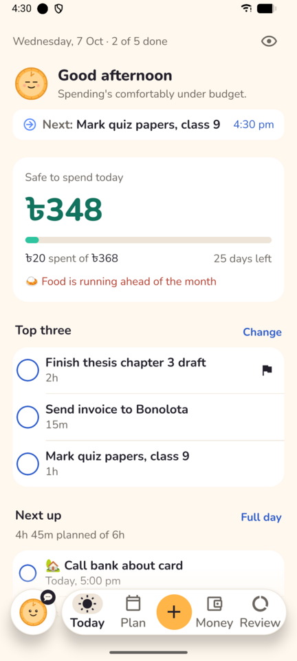
  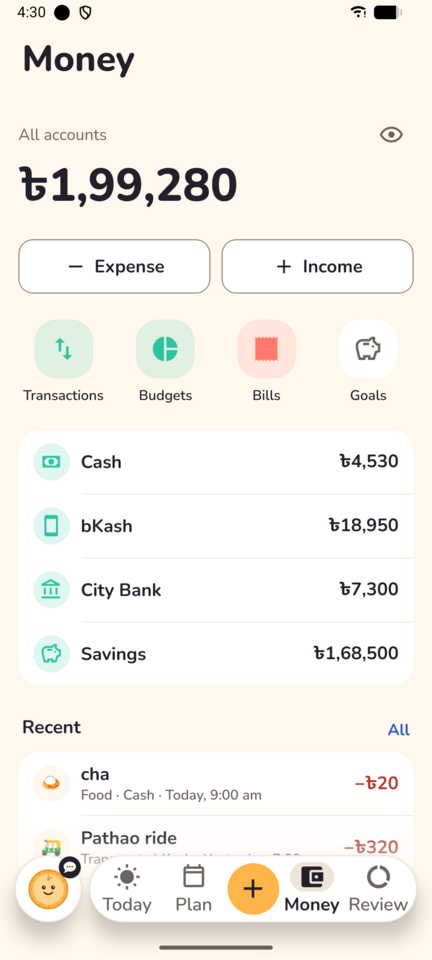
  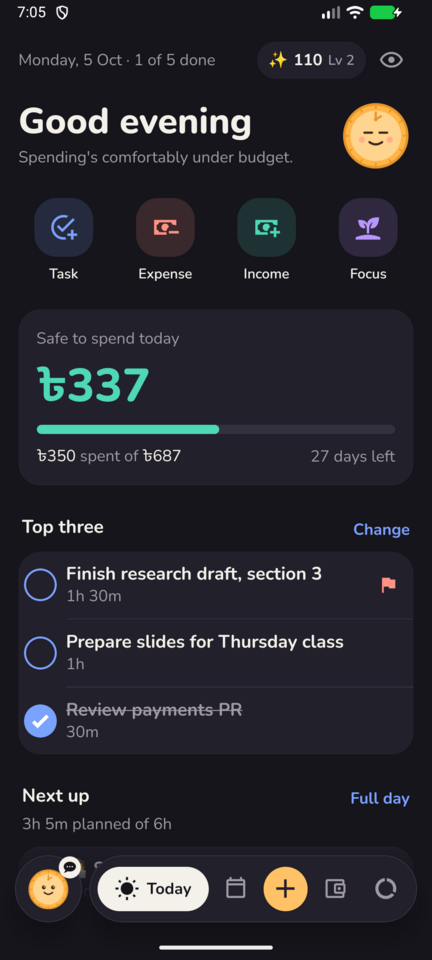
</p>

- **Sign in with Google**, natively (Android's account picker, no browser). Sign-up is
  open, and every account's data lives in its own database on the server.
- **Works offline.** Screens load from a cache and changes queue up, then sync in order
  when the connection returns.
- **Bangla and English**, typed or spoken, in quick-add and in the chat with Tiki.

## Contents

- [Screenshots](#screenshots)
- [Features](#features)
- [How it works](#how-it-works)
- [Getting started](#getting-started)
- [Configuration](#configuration)
- [Deploy the API](#deploy-the-api-vps-pm2-nginx)
- [Install the app](#install-the-app)
- [Project layout](#project-layout)
- [Notes on decisions](#notes-on-decisions)

## Screenshots

### Today and capture

Today leads with shortcuts for the four things logged most, the safe-to-spend number,
your top three and what's next. Quick-add reads plain text such as "biryani with friends
850" and shows what it understood before saving.

| Today | Further down | Quick-add | Task |
|:-:|:-:|:-:|:-:|
|  | 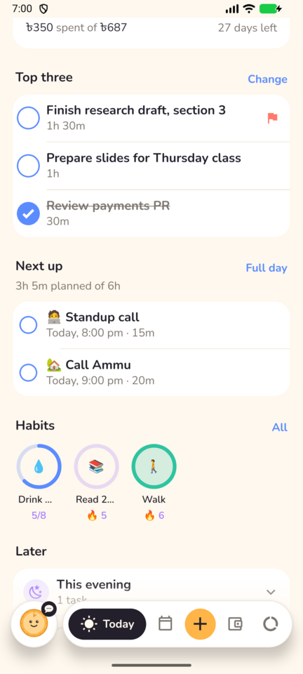 | 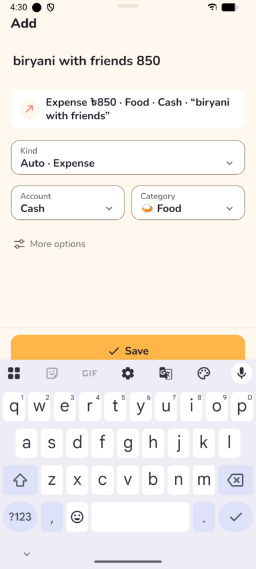 | 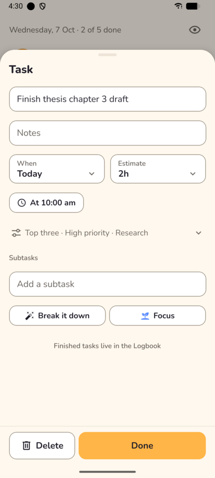 |

### Plan, habits and focus

| Plan | Day | Week | Habits | Focus |
|:-:|:-:|:-:|:-:|:-:|
| 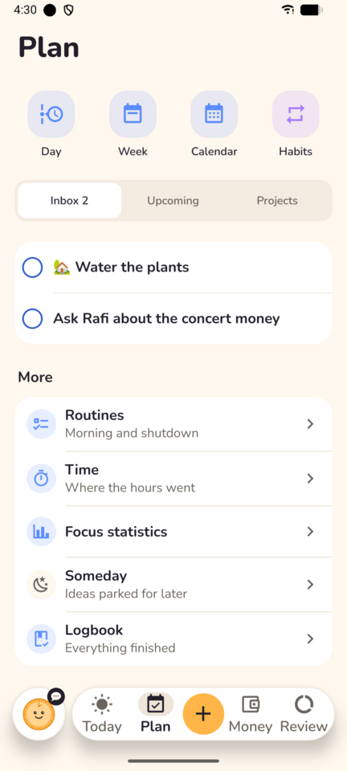 | 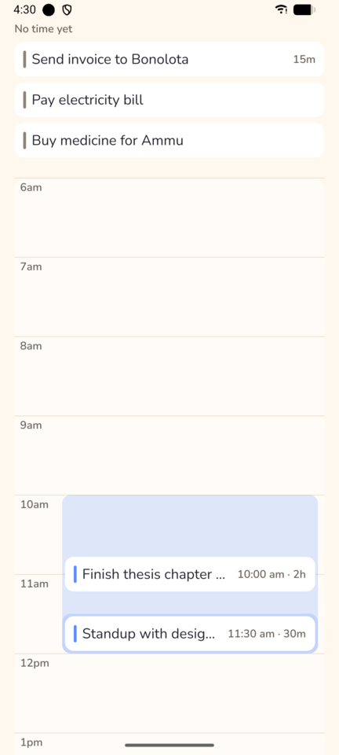 | 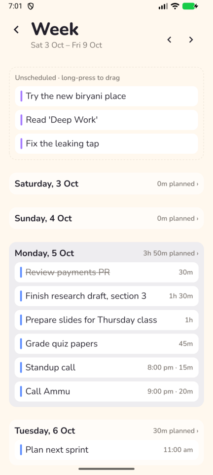 | 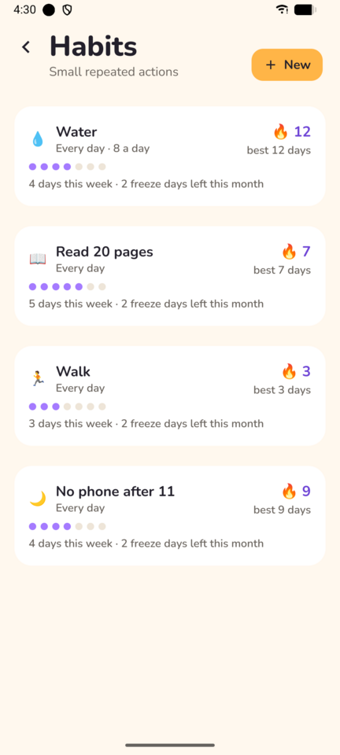 | 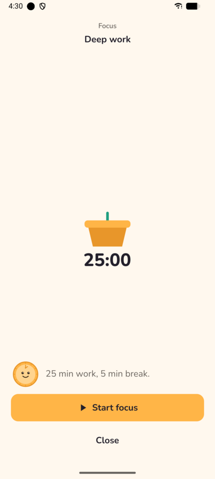 |

### Money

| Money | Transactions | Budgets | Goals |
|:-:|:-:|:-:|:-:|
|  | 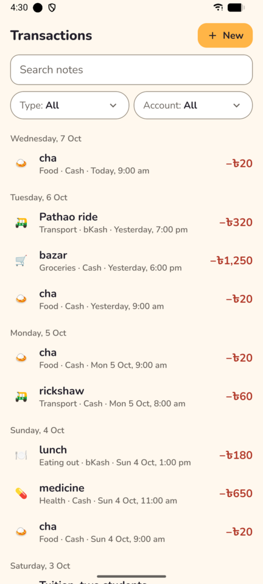 | 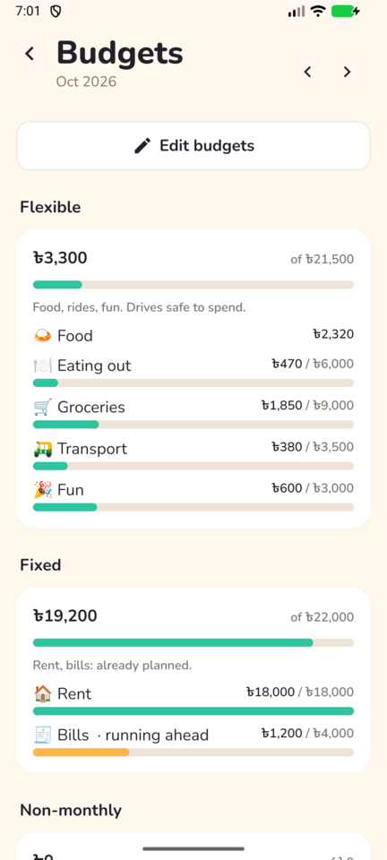 | 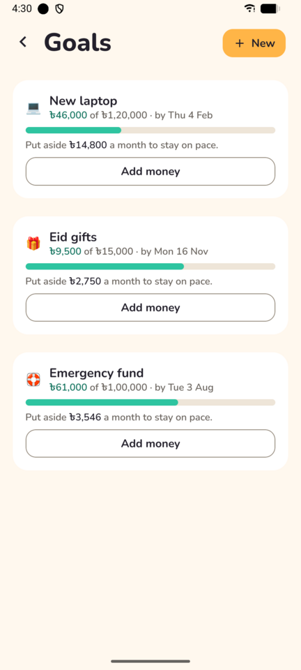 |

### Review and Tiki

| Review | Weekly review | Reports | Chat with Tiki |
|:-:|:-:|:-:|:-:|
| 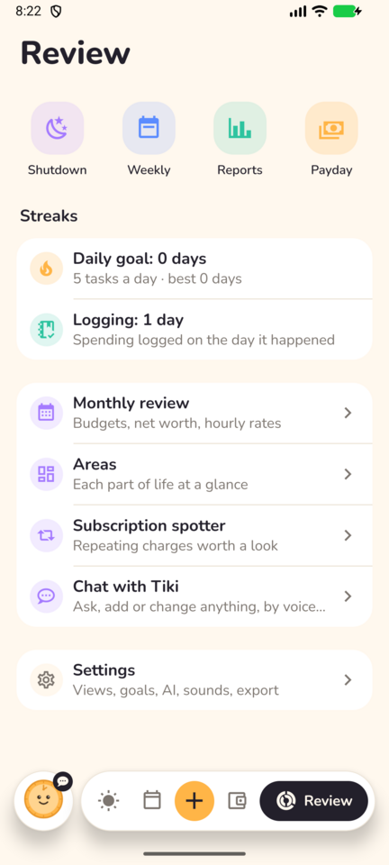 | 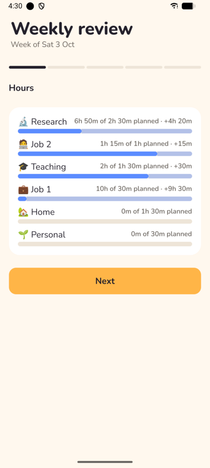 | 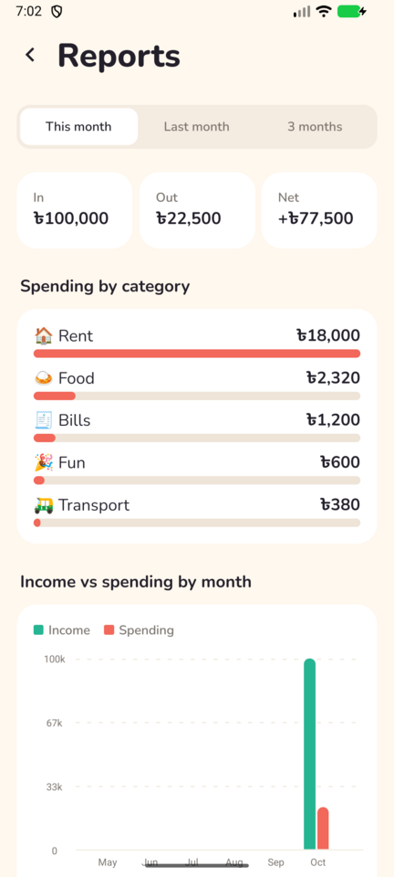 | 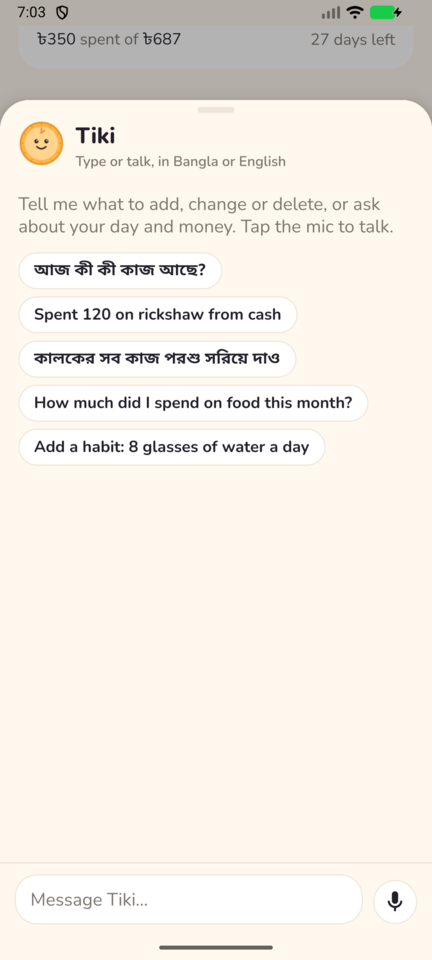 |

### Home-screen widget

Today at a glance without opening the app: safe to spend with a bar for how much of the
day's share is gone, the next task, top-three and habit progress, one-tap logging for
things you buy often, and buttons to add a task, log an expense or start focusing.

| Light | Dark |
|:-:|:-:|
| 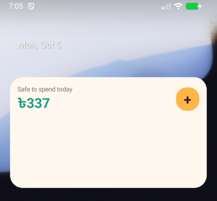 | 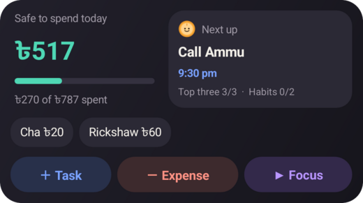 |

### Sign-in, settings and dark mode

| Sign in | Settings | Dark mode |
|:-:|:-:|:-:|
| 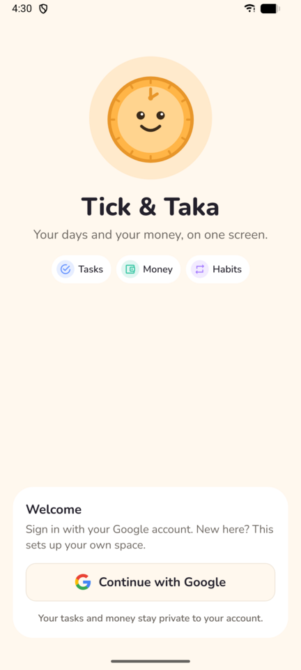 | 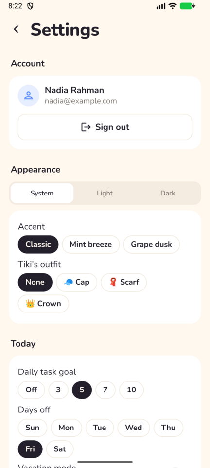 | 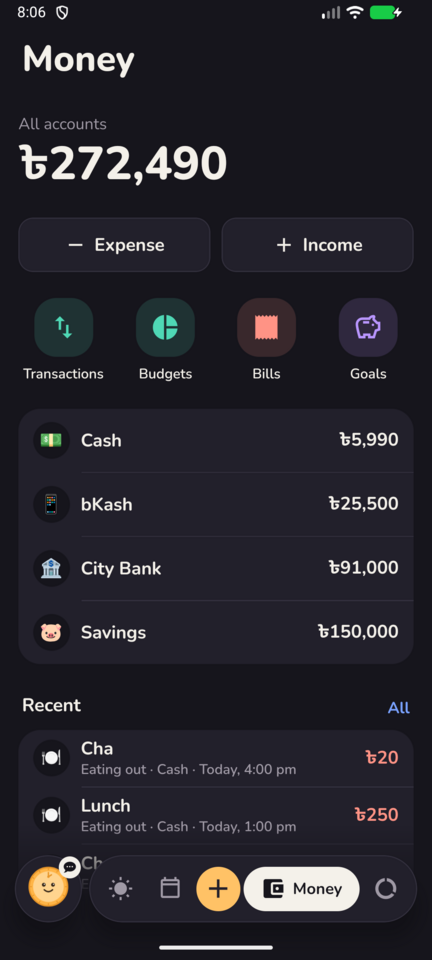 |

## Features

**Today**
- Greeting, date and progress toward your daily task goal, with Tiki's mood for the day.
- One-tap shortcuts: new task, expense, income, focus session.
- Safe to spend today: what your flexible budgets allow, after today's spending.
- Top three, next up (tasks, bills, paydays and debts due) and habit rings.
- A "Later" list: tasks from earlier, the evening, the next bill, the inbox, and a
  weekly recap on Fridays.

**Capture**
- Quick-add parses plain text into a task, expense, income or time entry ("cha 20",
  "+45000 salary", "2h thesis", "call bank tomorrow 5pm"). AI fills in when the text is
  unclear.
- Receipt photos, scanned by AI.
- App shortcuts on the launcher icon, and a home-screen widget with today at a glance and
  one-tap logging.

**Plan and time**
- Inbox, upcoming, projects by area of life, someday and a logbook of finished work.
- Day timeline and week planner with drag to schedule; "Plan my day" with AI.
- Repeating tasks in plain words ("every other Tuesday"), subtasks, deadlines, priority,
  an Eisenhower view.
- Morning and shutdown routines, time tracking, and a focus timer that grows a plant.
- Habits with daily or weekly targets, streaks and freeze days.

**Money**
- Accounts (cash, bank, mobile wallet, card, savings) with transfers and fees.
- Budgets split into flexible, fixed and non-monthly, with rollover.
- Bills and income on a schedule, savings goals, debts (who owes whom), trips and events,
  a shopping list and a spending calendar.
- Foreign-currency income converted at the rate you received it.

**Review**
- Daily shutdown, weekly and monthly reviews, reports, a dashboard per area of life, a
  payday plan and a subscription spotter.
- Streaks for your daily task goal and for logging spending the same day, with freeze
  days so one missed day doesn't reset them.
- Soft sounds and vibration when you finish something: a chime for a task or habit, a
  bell when focus ends, and confetti with a celebration for all three top tasks, a
  finished routine or a reached goal. They mix with your music, stay quiet
  on silent, and each can be switched off in Settings.

**Tiki, the assistant** (needs an OpenAI key on the server)
- Chat or talk, in Bangla or English, to add, change, delete or ask about anything, with
  undo for every change.
- Weekly coach, budget suggestions, "break it down" for big tasks.
- A monthly AI budget per user, which the server checks before every model call.
- Deletions always wait for your tap. A client that sends `draftMoney: true` with
  `POST /ai/assistant` gets money changes back as drafts (`done.drafts`) to confirm too,
  as the spec asks; the request a draft describes is what the phone sends on confirm.
- AI requests time out after 25 s (one retry), and a failure or an unusable answer is a
  `502 ai_error`, so the app falls back to its plain forms.

**Privacy and accounts**
- Google sign-in; one database per user, so nobody can reach anyone else's data.
- Fingerprint or face lock, a one-tap "hide amounts" switch, and a full JSON export.
- Signing out wipes that user's data from the phone.
- Light, dark or system theme, an accent tint, and an outfit for Tiki.

## How it works

```
 Android phone                               Server (one Bun process)
┌──────────────────────────────┐            ┌─────────────────────────────────────┐
│ Expo app                     │  HTTPS +   │ Hono API                            │
│  Google account picker ──────┼─ ID token ─▶  verifies with Google, issues JWT   │
│  TanStack Query cache        │  JWT       │  users.db: who can sign in          │
│  offline write queue         ◀────────────┤  users/<id>.db: one SQLite per user │
│  home-screen widget          │            │  croner: nightly jobs per time zone │
└──────────────────────────────┘            │  OpenAI (optional) for AI features  │
                                            └─────────────────────────────────────┘
```

- **Typed end to end.** The app imports only the API's route types (Hono RPC) plus pure
  logic and Zod schemas from `packages/shared`, so a server change that breaks the app
  fails type-checking.
- **One database per user.** Each request runs as its user, against that user's SQLite
  file, so none of the queries filter by user and none can leak another user's rows.
  Receipts and backups get per-user folders too.
- **Revocable sessions.** Each sign-in is a row in `users.db` (`sessions`), named by the
  token's `jti`. Tokens last 30 days and slide: `POST /auth/refresh` swaps a live token
  for a fresh one, `POST /auth/logout` ends the current session, and
  `DELETE /auth/account` deletes the user with their sessions, database files, receipts
  and backups (for the owner's inherited data, only their own files). A 401 says `session_expired` (ran out or signed out) or `unauthorized`
  (missing or not ours).
- **Offline first.** Reads come from a persisted cache. Every write goes through one
  queue that replays in order after a restart. IDs are made on the phone, so a retried
  write never duplicates.

**Stack:** Bun, Hono, Drizzle ORM, SQLite (WAL) on the server; Expo SDK 57, React Native
0.86, Expo Router, NativeWind, TanStack Query, Reanimated and
`@react-native-google-signin/google-signin` on the phone; Biome and TypeScript everywhere.

## Getting started

### Requirements

- Bun 1.3+ (package manager for every workspace)
- Node.js 24 (Expo's tooling needs it)
- For local Android builds: Android SDK and JDK 17. EAS Build needs neither.
- A Google Cloud project for sign-in (free).

```bash
bun install                      # all workspaces
bun run check                    # Biome, TypeScript and every test suite
```

### 1. Google sign-in

In Google Cloud Console › APIs & Services, in one project:

1. Configure the **OAuth consent screen** (External), and publish it so anyone can sign in.
2. Create an OAuth client of type **Web application**. Its client ID goes in the API's
   `GOOGLE_CLIENT_IDS` and the app's `EXPO_PUBLIC_GOOGLE_WEB_CLIENT_ID` (and in the `env`
   of each profile in `apps/mobile/eas.json`).
3. Create an OAuth client of type **Android** for package `com.mehedismathacademy.ticktaka`, once
   for each signing key: the SHA-1 of `apps/mobile/android/app/debug.keystore` for local
   builds and the one from `bunx eas-cli credentials` for EAS builds. Nothing from this
   client goes into the code; Google matches the app by package name and signature.

```bash
keytool -list -v -keystore apps/mobile/android/app/debug.keystore -storepass android | grep SHA1
```

### 2. API

```bash
cd apps/api
cp .env.example .env              # fill in GOOGLE_CLIENT_IDS, JWT_SECRET, OWNER_EMAIL
bun -e 'console.log(crypto.randomUUID() + crypto.randomUUID())'   # a JWT_SECRET
bun run dev                       # http://localhost:3000/health
```

A new account gets `users/<id>.db` next to `DB_PATH`, seeded with areas of life,
categories (with budget types) and the Morning and Shutdown routines. Migrations run when
a user's database is first opened. After changing `src/db/schema/*`, run
`bun run db:generate` and commit the new file in `drizzle/`.

Upgrading from the single-user version: set `OWNER_EMAIL` to your Google email. Your
first sign-in takes over the database at `DB_PATH`, with its receipts and backups.

### 3. Mobile

Google sign-in uses native code, so the app runs in a development build
(`expo-dev-client`), not Expo Go.

```bash
cd apps/mobile
cp .env.example .env              # EXPO_PUBLIC_API_URL, EXPO_PUBLIC_GOOGLE_WEB_CLIENT_ID
bunx eas-cli build -p android --profile development   # install the APK it prints
bun run start                     # expo start --dev-client
```

Or build and install locally with `bunx expo run:android` (needs the Android SDK). On the
Android emulator the API on your computer is `http://10.0.2.2:3000`, which is the default.

## Configuration

API (`apps/api/.env`):

| Variable | What it does |
|---|---|
| `GOOGLE_CLIENT_IDS` | Web client ID(s) whose Google ID tokens are accepted, comma-separated. Required. |
| `JWT_SECRET` | Signs the app's own sessions, 32+ characters. Required. |
| `DB_PATH` | The single-user database from before Google sign-in; user databases go in `users/` beside it. |
| `OWNER_EMAIL` | The Google email that inherits `DB_PATH` on first sign-in. |
| `USERS_DB_PATH`, `USER_DATA_DIR`, `UPLOADS_DIR`, `BACKUPS_DIR` | Override where the user list, user databases, receipts and backups live. |
| `OPENAI_API_KEY` | Turns AI features on. |
| `OPENAI_MODEL_FAST`, `OPENAI_MODEL_SMART`, `OPENAI_MODEL_TRANSCRIBE` | Model names, so models change without a code change. |
| `OPENAI_*_MICROS_PER_MTOK` | Prices per million tokens for models missing from the built-in price list (`src/ai/pricing.ts`, which has gpt-6-luna and gpt-4o-mini-transcribe). |
| `AI_USER_MONTHLY_CAP_MICROS` | Most AI may cost each user other than `OWNER_EMAIL` per month (default 2000000 = $2, 0 = no limit). The owner is never limited. |
| `HOST`, `PORT`, `JOBS_ENABLED` | Where to listen (default `127.0.0.1:3000`, so only Nginx can reach it; use `0.0.0.0` only to test from a phone on your Wi-Fi); whether to run the nightly jobs. |
| `TRUST_PROXY` | `true` behind Nginx: the sign-in limit (5 tries per 15 minutes) reads Nginx's `X-Real-IP`, and only from a loopback peer. Default `false`, which uses the socket address. |
| `SITE_OPERATOR`, `CONTACT_EMAIL` | Who runs the service and how to reach them, shown on the public home (`/`), privacy (`/privacy`) and terms (`/terms`) pages used by Google's consent screen. |

App (`apps/mobile/.env`, and `env` in `eas.json` for EAS builds):

| Variable | What it does |
|---|---|
| `EXPO_PUBLIC_API_URL` | The API's address. |
| `EXPO_PUBLIC_GOOGLE_WEB_CLIENT_ID` | The same Web client ID as `GOOGLE_CLIENT_IDS`. |

## Deploy the API (VPS, pm2, Nginx)

Run exactly one pm2 instance in fork mode: SQLite wants a single writer and the
scheduled jobs must run once.

One host and port everywhere: the API is served at `https://tick.mehedismathacademy.com`
(`server_name` in `deploy/nginx-tick-taka.conf`, `EXPO_PUBLIC_API_URL` in
`apps/mobile/eas.json`) and listens on `127.0.0.1:3003` (`proxy_pass` in the Nginx file,
`PORT` in the server's `.env`). Locally the API stays on the default port 3000, which the
Android emulator reaches as `http://10.0.2.2:3000`.

```bash
git clone <repo> ~/tick-taka && cd ~/tick-taka && bun install --frozen-lockfile
mkdir -p ~/tick-taka-data/backups ~/tick-taka-data/uploads
nano apps/api/.env                # HOST=127.0.0.1, PORT=3003, TRUST_PROXY=true,
                                  # DB_PATH=~/tick-taka-data/app.db, secrets
chmod 600 apps/api/.env
cd apps/api && pm2 start ecosystem.config.cjs && pm2 save && pm2 startup
pm2 install pm2-logrotate
sudo cp ~/tick-taka/deploy/nginx-tick-taka.conf /etc/nginx/sites-available/tick-taka
sudo ln -s /etc/nginx/sites-available/tick-taka /etc/nginx/sites-enabled/
sudo nginx -t && sudo systemctl reload nginx
sudo certbot --nginx -d tick.mehedismathacademy.com
```

Certbot adds the HTTPS server block and the HTTP→HTTPS redirect to the installed copy;
keep its `location /ai/` block (a 120 s read timeout and no buffering, for slow AI calls
and the assistant's event stream) when you edit it later. Logs are one JSON line per
request (`pm2 logs tick-taka-api`), each with the `x-request-id` the response carries.

Updating: `git pull && bun install --frozen-lockfile && pm2 restart tick-taka-api`.

### Backups

Every night at 3 am in each user's time zone, the API writes a `VACUUM INTO` copy of that
user's database to `backups/users/<id>/` and keeps the newest 14 (the owner's inherited
database keeps backing up to `backups/` itself). Each copy is written to a `.partial`
file, opened read-only and passed through `PRAGMA integrity_check` before it replaces
anything; a copy that fails is deleted and the job retried on the next hourly tick. A
backup missed because the server was down runs on the next tick (and 10 seconds after
start).

Backups on the same disk as the live data die with it. The API logs a warning at start
when they share a disk. Either point `BACKUPS_DIR` at another disk or mount, or copy the
folder off the server nightly, for example with a cron entry on the VPS:

```bash
# 04:30 every night: push backups to another machine (or `rclone sync` to B2/S3)
30 4 * * * rsync -a --delete ~/tick-taka-data/backups/ backup@other-host:tick-taka-backups/
```

Once a month, restore one locally to check it works:

```bash
sqlite3 ~/tick-taka-data/backups/users/<id>/app-2026-10-04.db "pragma integrity_check; select count(*) from transactions;"
```

Settings › Export downloads a full JSON export to the phone.

## Install the app

```bash
cd apps/mobile
bunx eas-cli build -p android --profile preview    # APK pointing at the HTTPS API
```

Preview and production APKs allow HTTPS only (`app.config.ts` turns cleartext HTTP on
just for local development and the `development` profile) and refuse to build unless
`EXPO_PUBLIC_API_URL` starts with `https://`.

The app is installed as an APK. It never asks to read your messages: SMS permissions are
blocked in the build, so the phone can't grant them even by accident.

## Project layout

```
tick-taka/
  apps/api/              Bun + Hono + Drizzle + SQLite (one process, pm2, croner jobs)
    src/modules/         one folder per resource: routes and service
    src/db/              schema, migrations runner, seed, users registry
    drizzle/             generated SQL migrations
  apps/mobile/           Expo + Expo Router app, Android only
    src/app/             screens (file-based routes)
    src/features/        feature components and hooks
    src/components/ui/   the shared UI kit
  packages/shared/       Zod schemas and pure domain logic used by both
  deploy/                Nginx site config
  docs/                  implementation plan and these screenshots
```

The full product and technical spec is in `tick_taka_spec.pdf`; the build order is in
[`docs/IMPLEMENTATION_PLAN.md`](docs/IMPLEMENTATION_PLAN.md). Design and product briefs:
[`DESIGN.md`](DESIGN.md), [`PRODUCT.md`](PRODUCT.md).

## Notes on decisions

- **Bun everywhere**, as the spec asks; Bun's linker is set to `hoisted` (`bunfig.toml`)
  because Metro expects a flat `node_modules`.
- **A database per user** instead of a `user_id` on every row: complete separation with
  no chance of a missed filter, simple per-user backups and export, and the existing
  queries unchanged.
- **Money** is integer minor units everywhere; **instants** are UTC epoch ms; habit dates
  and budget months are local strings in the user's time zone.
- **Offline**: every write goes through one scoped mutation key, so queued writes replay
  in order after a restart. PATCHes carry the edit time and lose to newer rows.
- **Weekdays** in plain-words recurrence ("every weekday") follow the Bangladesh work
  week, Sunday to Thursday; the default week starts on Saturday. Both are settings.
- A few columns beyond the spec's table list: `tasks.urgent` and `tasks.sort`
  (Eisenhower and ordering), `tasks.goal_id` (goals become tasks), `time_entries.note`,
  `habits.remind_at`, `recurring.currency/active/overdue_at`, `goals.create_tasks`,
  `debts.remind_at`, and `sort` columns on lists.
